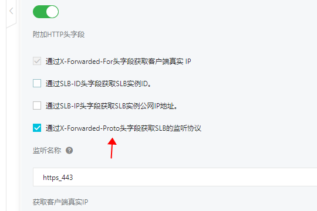

# janus-server-sdk

[](https://github.com/xuyuanxiang/janus-server-sdk/blob/master/LICENSE) 
[](https://bintray.com/freeman/janus/com.github.xuyuanxiang%3Ajanus-server-sdk/_latestVersion) 
[](https://codecov.io/gh/xuyuanxiang/janus-server-sdk) 
[](https://travis-ci.org/xuyuanxiang/janus-server-sdk) 
[](https://docs.spring.io/spring-boot/docs/2.2.5.RELEASE/reference/html/) 
[](https://docs.spring.io/spring-security/site/docs/5.2.2.RELEASE/reference/html5) 
[](https://docs.spring.io/spring-session/docs/2.2.1.RELEASE/reference/html/) 

聚合支付宝、微信用户网页授权（OAuth）客户端。自动装配，只需配置简单的中间件和授权参数即可。

_下文提及的"宿主项目"一律指代：安装了 janus-server-sdk 的 spring-boot 工程。_

## 目录

- [业务规则](#业务规则)
- [安装依赖](#安装依赖)
- [参数配置](#参数配置)
- [自定义角色/权限](#自定义角色/权限)
- [获取当前用户信息](#获取当前用户)
- [应答方式](#应答方式)
- [i18n](#i18n)
- [HTTPS](#HTTPS)
- [Janus](#Janus)


## 业务规则

### 时序图



参考资料：

- [微信用户网页授权](https://mp.weixin.qq.com/wiki?action=doc&id=mp1421140842&t=0.888455262701805)
- [支付宝用户网页授权](https://docs.open.alipay.com/53/104114)

### 流程图

内部处理逻辑：


#### 异常类型

+ 系统异常：
    - 请求失败：请求未能打到支付宝/微信网关，可能是：连接超时、DSN解析异常、网络故障...
    - 响应错误：支付宝/微信接口返回非2xx HTTP状态、接口响应超时
    - 未知异常：支付宝/微信接口异常，未按文档约定返回正确的HTTP报文
    - 内部错误：中间件不可用
+ 业务异常：
    - 微信接口返回错误码、错误信息
    - 支付宝接口返回错误码、错误信息

#### 功能页

在 application.yml 中自定义以下参数：

```yaml
janus:
  failure-url: /500
  fallback-url: /401
  denied-url: /403
  logout-request-url: /logout
  logout-success-url: /logout/success
```

**以上均为缺省值。宿主项目可以在对应路由下返回一个对用户友好的HTML错误页。**


[应答方式](#应答方式)和[i18n](#i18n)章节中，有更多关于异常的描述。

## 安装依赖

### Gradle

```groovy
repositories {
    maven {
        url  "https://freeman.bintray.com/janus" 
    }
}

dependencies {
    implementation 'com.github.xuyuanxiang:janus-server-sdk:1.0.0'
}
```

### Maven

settings.xml:

```xml
<?xml version="1.0" encoding="UTF-8" ?>
<settings xsi:schemaLocation='http://maven.apache.org/SETTINGS/1.0.0 http://maven.apache.org/xsd/settings-1.0.0.xsd'
          xmlns='http://maven.apache.org/SETTINGS/1.0.0' xmlns:xsi='http://www.w3.org/2001/XMLSchema-instance'>
    
    <profiles>
        <profile>
            <repositories>
                <repository>
                    <snapshots>
                        <enabled>false</enabled>
                    </snapshots>
                    <id>bintray-freeman-janus</id>
                    <name>bintray</name>
                    <url>https://freeman.bintray.com/janus</url>
                </repository>
            </repositories>
            <pluginRepositories>
                <pluginRepository>
                    <snapshots>
                        <enabled>false</enabled>
                    </snapshots>
                    <id>bintray-freeman-janus</id>
                    <name>bintray-plugins</name>
                    <url>https://freeman.bintray.com/janus</url>
                </pluginRepository>
            </pluginRepositories>
            <id>bintray</id>
        </profile>
    </profiles>
    <activeProfiles>
        <activeProfile>bintray</activeProfile>
    </activeProfiles>
</settings>
```

pom.xml:

```xml
<dependency>
  <groupId>com.github.xuyuanxiang</groupId>
  <artifactId>janus-server-sdk</artifactId>
  <version>1.0.0</version>
  <type>pom</type>
</dependency>
```

## 参数配置

application.yml 示例：

```yaml
spring:
  session:
    timeout: 10m
janus:
  alipay:
    app-id: APPID
    sign-type: RSA2
    private-key: PRIVATE—KEY
  wechat:
    appid: APPID
    secret: SECRET
```

以上是最少配置，其他配置及说明详见：[JanusProperties.java](src/main/java/com/github/xuyuanxiang/janus/JanusProperties.java)注释。

### 使用 Redis 存储 session

第一步，添加依赖：

```xml
<dependencies>
    <dependency>
        <groupId>com.github.xuyuanxiang</groupId>
        <artifactId>janus-server-sdk</artifactId>
        <version>1.0.0</version>
    </dependency>
    <dependency>
        <groupId>org.springframework.boot</groupId>
        <artifactId>spring-boot-starter-data-redis</artifactId>
    </dependency>
    <dependency>
        <groupId>org.springframework.session</groupId>
        <artifactId>spring-session-data-redis</artifactId>
    </dependency>
</dependencies>
```

第二步，配置连接参数：

```yaml
spring:
  redis:
    lettuce:
      pool:
        max-active: 32
        max-idle: 8
        max-wait: 2s
    timeout: 600ms
    host: localhost
    port: 6379
    password: mypassword
    database: 11
  session:
    redis:
      namespace: myApp:session
    timeout: 2h
janus:
  alipay:
    app-id: APPID
    sign-type: RSA2
    private-key: PRIVATE—KEY
  wechat:
    appid: APPID
    secret: SECRET
```

在[spring-session](https://docs.spring.io/spring-session/docs/2.2.1.RELEASE/reference/html/)文档中查看更多 session 存储方式。

### 自定义角色/权限

默认情况下，用户使用支付宝或微信在未授权情况下访问任意路径，都会跳转到相应的授权页面，待用户同意授权后会返回未登录前所访问的路径。

注入一个 Bean 实现自定义：

```java
import com.github.xuyuanxiang.janus.custom.CustomAuthorizationConfiguration;
import org.springframework.context.annotation.Bean;
import org.springframework.context.annotation.Configuration;
import org.springframework.http.HttpMethod;

@Configuration
public class MyConfiguration {
    @Bean
    CustomAuthorizationConfiguration customAuthorizationConfiguration() {
        // Expression-Based Access Control
        return httpSecurity -> httpSecurity.authorizeRequests()
            .antMatchers(HttpMethod.GET, "/api/protected", "/ping").permitAll()
            .anyRequest().authenticated();
    }
}

```

spring-security 文档中有详细的使用方式：

- [Expression-Based Access Control](https://docs.spring.io/spring-security/site/docs/5.2.2.RELEASE/reference/html5/#el-access)
- 除了上面代码示例中的方式，还可以使用[Method Security](https://docs.spring.io/spring-security/site/docs/5.2.2.RELEASE/reference/html5/#jc-method)

### 获取当前用户

```java
import com.github.xuyuanxiang.janus.model.JanusAuthentication;
import com.github.xuyuanxiang.janus.model.User;
import org.springframework.security.core.context.SecurityContextHolder;
import org.springframework.web.bind.annotation.GetMapping;
import org.springframework.web.bind.annotation.RequestMapping;
import org.springframework.web.bind.annotation.RestController;

@RestController
@RequestMapping("/api/profile")
public class MyController {
    @GetMapping
    public User getUser() {
        JanusAuthentication authentication = (JanusAuthentication) SecurityContextHolder.getContext().getAuthentication();
        return authentication.getUser();
    }
}
```

属性详见[User 类](src/main/java/com/github/xuyuanxiang/janus/model/User.java)。

[JanusAuthentication 类](src/main/java/com/github/xuyuanxiang/janus/model/JanusAuthentication.java)储存了 access_token 及其有效期，创建时间，授权方式等信息。

## 应答方式

**下文中使用`${expression}`来标识具有特定含义的内容，比如：占位符，伪代码等等。**

`User-Agent`必须包含：`MicroMessenger`或者`AlipayClient`，即需要在支付宝或微信客户端中访问网页，否则一律响应：

```yaml
HTTP/1.1 302 Redirection
Location: ${janus.fallback-url}?error=UNAUTHORIZED&error_description=${encodeURIComponent(请在支付宝或者微信中访问当前页面)}
```

可在`application.yml`中配置`janus.fallback-url`自定义路由，缺省值：`/401`:

```yaml
janus:
  fallback-url: /401
```

_宿主项目可在该请求路径下，响应一个对用户友好的 HTML 页之类的。_

### 首次进入（未授权）时访问任意受保护的路径

支付宝/微信客户端 Webview 请求：

```yaml
GET /foo/bar HTTP/1.1
User-Agent: ${AlipayClient || MicroMessenger}
Host: ${我是宿主服务域名占位符}
```

janus-server-sdk 响应：

```yaml
HTTP/1.1 302 Redirectiton
Location: ${支付宝 || 微信授权URL}
```

如果请求头`Accept`中带有`application/json`（比如宿主项目前端 Ajax 请求）：

```yaml
GET /foo/bar HTTP/1.1
Accept: application/json;charset=UTF-8
User-Agent: ${AlipayClient || MicroMessenger}
Host: ${我是宿主服务域名占位符}
```

janus-server-sdk 则会响应 JSON 格式数据，而不再跳转到授权 URL：

```yaml
HTTP/1.1 401 Unauthorized
Content-Type: application/json;charset=UTF-8

{
  "error": "UNAUTHORIZED",
  "error_description": "请在支付宝或者微信中访问当前页面"
}
```

### 用户同意授权，但获取 access_token 或者拉取用户信息时失败

用户在支付宝或微信授权页面同意授权后，会携带 auth_code 返回`/oauth/callback`路径，这一路径是写死的，不可配。

janus-server-sdk 一旦在`/oauth/callback`请求路径中接收到 auth_code（支付宝）或者 code（微信）参数则会调用支付宝或微信接口获取 access_token，

拿到 access_token 后，再调支付宝或微信接口通过 access_token 换取用户信息。

#### 系统异常

系统异常，会携带错误描述信息引导用户跳转到`janus.failure-url`所配置的路由，缺省值：`/500`。

可在`application.yml`自定义其他值：

```yaml
janus:
  failure-url: /500
```

_宿主项目可在该请求路径下，响应一个对用户友好的 HTML 错误页之类的。_

系统异常细分下列 4 种情况:

1. 请求失败——请求没有打到支付宝或者微信 API 网关，连接超时，DNS 解析异常... ：

```yaml
HTTP/1.1 302 Redirectiton
Location: ${janus.failure-url}?error=WECHAT_REQUEST_FAILED&error_description=${encodeURIComponent(微信请求失败，请检查网络连接情况。异常：${0})}
```

_error_description 参数占位符`${0}`为具体的异常，比如：`java.net.SocketTimeoutException: balabla`。_

2. 响应错误——支付宝或者微信 API 网关响应**非 2xx**HTTP 状态码，或者接口响应超时：

```yaml
HTTP/1.1 302 Redirectiton
Location: ${janus.failure-url}?error=ALIPAY_RESPONSE_ERROR&error_description=${encodeURIComponent(支付宝网关不可用，请稍后重试或联系支付宝客服。响应报文：${0})}
```

可在`application.yml`中配置请求和响应超时阈值：

```yaml
janus:
  connection-timeout: 5s # 请求超时阈值：5秒
  read-timeout: 1m # 响应超时阈值：1分钟
```

3. 未知错误——支付宝或者微信响应 HTTP 200，但是报文类型不对，或者报文非 JSON 格式：

```yaml
HTTP/1.1 302 Redirectiton
Location: ${janus.failure-url}?error=WECHAT_UNKNOWN_ERROR&error_description=${encodeURIComponent(微信接口返回数据解析失败，可能是未按文档约定返回正确的HTTP报文格式或数据结构)}
```

正常情况下：

- 支付宝接口应该响应`Content-Type: text/html;Charset=UTF-8`，报文数据为 JSON 格式。
- 微信接口应该响`Content-Type: text/plain`，报文数据为 JSON 格式。

4. 内部错误——中间件（比如：redis）不可用

**janus-server-sdk 会在系统错误首次发生后，递增间隔时间最多再重试 3 次，全都失败才会引导用户返回`janus.failure-url`页面。**

#### 业务异常

支付宝/微信接口请求和响应成功，返回 JSON 结构体中携带错误信息和错误码。

```text
HTTP/1.1 302 Redirectiton
Location: ${janus.denied-url}?error=WECHAT_BUSINESS_EXCEPTION&error_description=${encodeURIComponent(微信授权失败（errcode: ${0}, errmsg: ${1}）)}
```

```text
HTTP/1.1 302 Redirectiton
Location: ${janus.denied-url}?error=ALIPAY_BUSINESS_EXCEPTION&error_description=${encodeURIComponent(支付宝授权失败（code: {0}, msg: {1}, sub_code: {2}, sub_msg: {3}）)}
```

error_description 中的占位符会被替换为支付宝/微信返回的错误码及错误信息字段值。

**janus-server-sdk 不会对业务异常进行重试，失败 1 次即引导用户返回`janus.denied-url`页面，缺省值：`/403`。**

可在`application.yml`自定义其他值：

```yaml
janus:
  denied-url: /403
```

_宿主项目可在该请求路径下，响应一个对用户友好的 HTML 错误页之类的。_

## i18n

项目自带简体中文的错误描述（即上文 error_description 字段）：[janus.properties](src/main/resources/janus.properties)。

其中的 key 即上文的 error 字段，`${}`占位符会替换为实际运行时的内容。

```properties
INTERNAL_SERVER_ERROR=系统错误：${ExceptionUtils.getRootCause(throwable).toString()}
WECHAT_REQUEST_FAILED=微信请求失败，请检查网络连接情况。异常：${ExceptionUtils.getRootCause(throwable).toString()}
WECHAT_RESPONSE_ERROR=微信网关不可用，请稍后重试或联系微信客服。响应报文：${ResponseEntity.toString()}
WECHAT_BUSINESS_EXCEPTION=微信授权失败（errcode: ${微信接口返回字段}, errmsg: ${微信接口返回字段}）
WECHAT_UNKNOWN_ERROR=微信接口返回数据解析失败，可能是未按文档约定返回正确的HTTP报文格式或数据结构
ALIPAY_REQUEST_FAILED=支付宝请求失败，请检查网络连接情况。异常：${ExceptionUtils.getRootCause(throwable).toString()}
ALIPAY_RESPONSE_ERROR=支付宝网关不可用，请稍后重试或联系支付宝客服。响应报文：${ResponseEntity.toString()}
ALIPAY_BUSINESS_EXCEPTION=支付宝授权失败（code: ${支付宝接口返回字段}, msg: ${支付宝接口返回字段}, sub_code: ${支付宝接口返回字段}, sub_msg: ${支付宝接口返回字段}）
ALIPAY_UNKNOWN_ERROR=支付宝接口返回数据解析失败，可能是未按文档约定返回正确的HTTP报文格式或数据结构
FORBIDDEN=您没有权限访问当前页面
UNAUTHORIZED=请在支付宝或者微信中访问当前页面
```

如需其他语言的文案，可以在宿主项目`resources`目录中存放比如：`janus_en.properties`、`janus_zh_TW.properties`等文件即可。

通过用户代理 HTTP 请求 Header 中的 Accept-Language 字段值匹配对应语言的描述信息。

比如，用户默认语言设为英文时，用户代理发送请求时通常会携带：

Accept-Language: en-US,en;

默认语言为中文时，用户代理发送请求时通常会携带：

Accept-Language: zh-CN;

## HTTPS

使用 Nginx 或云服务（比如：阿里云 SLB）做代理转发时，只要有以下请求头之一：

```yaml
Forwarded: proto=https;host=${宿主服务域名}
X-Forwarded-Proto: https
X-Forwarded-Ssl: on
```

spring-security 就"认为"原始请求是一个 HTTPS 请求，参考文献：[https://tools.ietf.org/html/rfc7239](https://tools.ietf.org/html/rfc7239)。

请确保代理转发时添加了以上**任意一个请求头**。

阿里云 SLB 勾选红箭头所示选项：



Nginx：

```text
server {
  # 其他配置略
  location / {
    # 其他配置略
    proxy_set_header X-Forwarded-Proto $scheme;
    # 或者：
    # proxy_set_header X-Forwarded-Ssl on;
  }
}
```

# Janus

## janus-server-sdk

Maven依赖，聚合登录SDK。

## janus-cas

统一聚合登录服务（单点登录），依赖janus-server-sdk。

## janus-cas-client

统一登录服务客户端SDK，对接janus-cas。

## 关系

单服务部署集成janus-server-sdk即完成支付宝/微信用户授权登录的对接。

当存在多个微服务共用同一个支付宝应用/微信公众号ID的情况时，需要有唯一的中控服务：janus-cas来统一和支付宝与微信接口交互，维护和分发access_token、分享用户信息和会话等。

微服务集成janus-cas-client即完成与janus-cas的对接，实现同一个支付宝/微信用户在所有服务集群中统一登录，统一退出。
