# janus-server-sdk

[](https://codecov.io/gh/xuyuanxiang/janus-server-sdk)
[](https://travis-ci.org/xuyuanxiang/janus-server-sdk)

基于 spring-security 封装的微信和支付宝用户网页授权（OAuth）客户端，项目遵循 spring-boot 自动装配的风格，引入依赖后做一些简单的中间件和授权参数的配置即可。

## 目录

+ [业务规则](#业务规则)
    - [支付宝授权](#支付宝授权)
    - [微信直接授权](#微信直接授权)
    - [微信代理授权](#微信代理授权)
+ [参数配置](#参数配置)
    - [中间件配置](#中间件配置)
    - [支付宝授权参数配置](#支付宝授权参数配置)
    - [微信授权参数配置](#微信授权参数配置)
+ [权限配置](#权限配置)
+ [FAQ](#FAQ)

## 业务规则


在微信的业务领域里存在**公众号**和**第三方平台**。

它们之间是多对多的关系: 一个公众号可以授权给多家第三方平台, 一个第三方平台可以代多个公众号实现具体业务。

+ 直接授权：**公众号**引导微信用户进行OAuth网页授权, 详见：[微信网页授权](https://mp.weixin.qq.com/wiki?action=doc&id=mp1421140842&t=0.888455262701805)。
+ 代理授权：**第三方平台**代**公众号**引导微信用户进行OAuth网页授权，详见：[第三方平台概述](https://open.weixin.qq.com/cgi-bin/showdocument?action=dir_list&t=resource/res_list&verify=1&id=open1419318292&token=&lang=zh_CN) + [代公众号发起网页授权](https://open.weixin.qq.com/cgi-bin/showdocument?action=dir_list&t=resource/res_list&verify=1&id=open1419318590&token=&lang=zh_CN)

### 支付宝授权



### 微信直接授权

> TODO: sequence diagram

+ 条件1：用户首次登录（之前从未登录过，或者清理了手机，或者卸载重装了支付宝App等）。
+ 条件2：用户之前登录，只是暂时退出，在服务端登录态存在（session还未超时失效）的情况下再次访问。
+ 条件3：启用了Remember Me功能，并且用户之前登录过。

session 有效期通常与 access_token 有效期一致，对于只需要 userId/openid 并不依赖 access_token 的业务场景，可以一直启用Remember Me，这样可以减少至少2次302跳转，对首屏访问有一定助益。


### 微信代理授权

> TODO: description

## 参数配置

### 中间件配置

> TODO: description

### 支付宝授权参数配置

> TODO: description

### 微信授权参数配置

> TODO: description

## 权限配置

> TODO: example

## FAQ

### 为什么HTTPS在授权登录后总是跳转到HTTP？

常见于Nginx或者一些云服务（比如：阿里云SLB）代理转发的情况。

参考文献：[https://tools.ietf.org/html/rfc7239](https://tools.ietf.org/html/rfc7239)。

```yaml
Forwarded: proto=https;host=spa.shouqianba.com
X-Forwarded-Proto: https
X-Forwarded-Ssl: on
```

只要有以上请求头之一，spring-security 就"认为"原始请求是一个HTTPS请求。

请确保代理转发时添加了以上请求头之一：


然后参照[stackoverflow类似的解决方案](https://stackoverflow.com/questions/51404552/spring-boot-oauth-always-redirecting-to-http-ibm-cloud-cf-spring-boot-2)，注入：

```java
@Bean
FilterRegistrationBean<ForwardedHeaderFilter> forwardedHeaderFilter() {

    final FilterRegistrationBean<ForwardedHeaderFilter> filterRegistrationBean = new FilterRegistrationBean<ForwardedHeaderFilter>();

    filterRegistrationBean.setFilter(new ForwardedHeaderFilter());
    filterRegistrationBean.setOrder(Ordered.HIGHEST_PRECEDENCE);

    return filterRegistrationBean;
}
```

